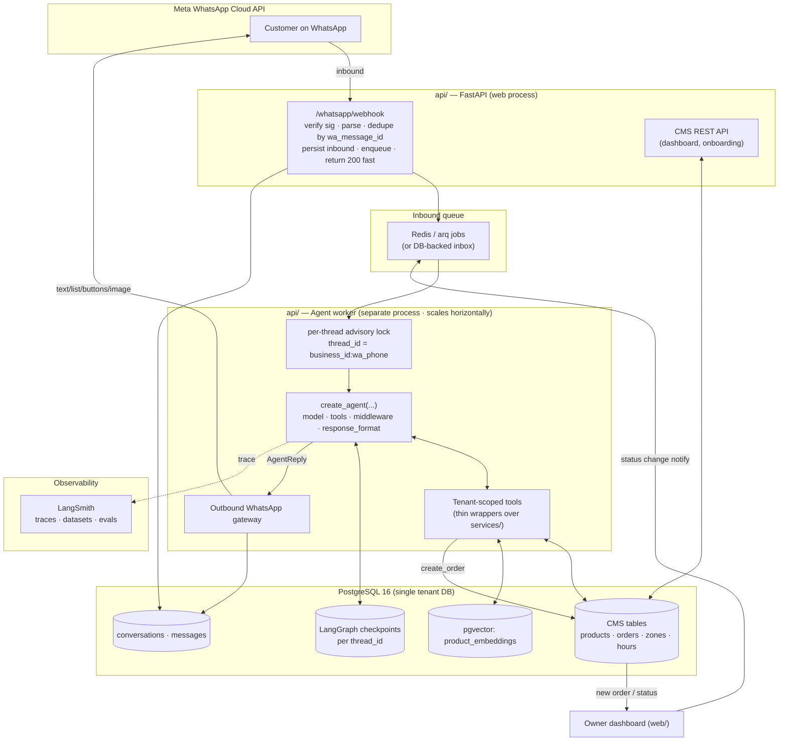
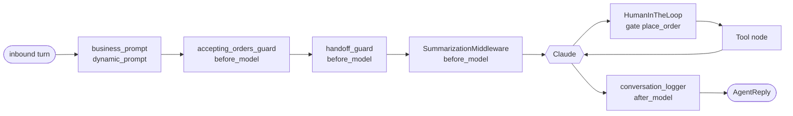
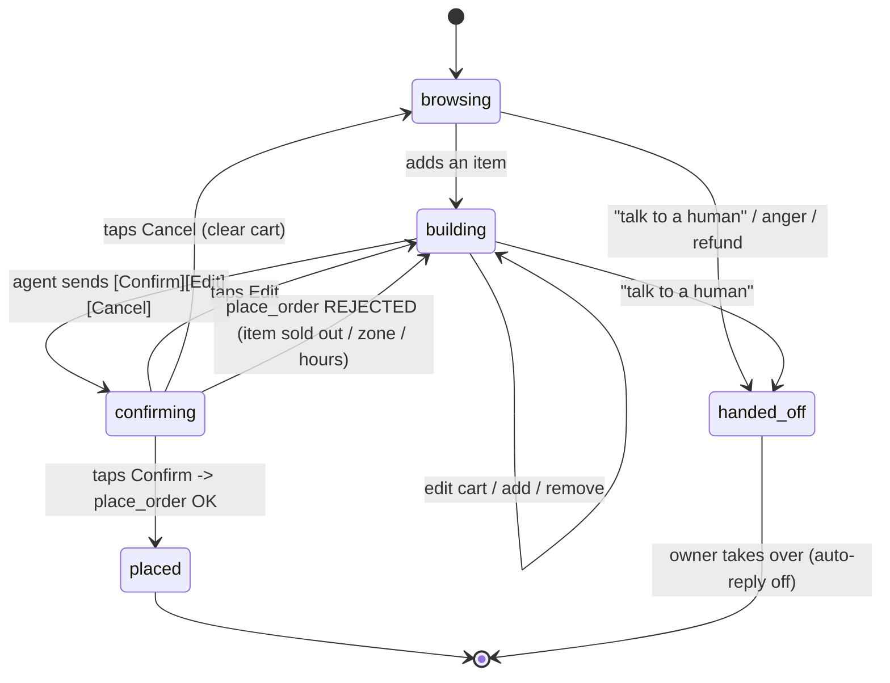
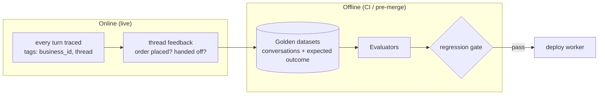
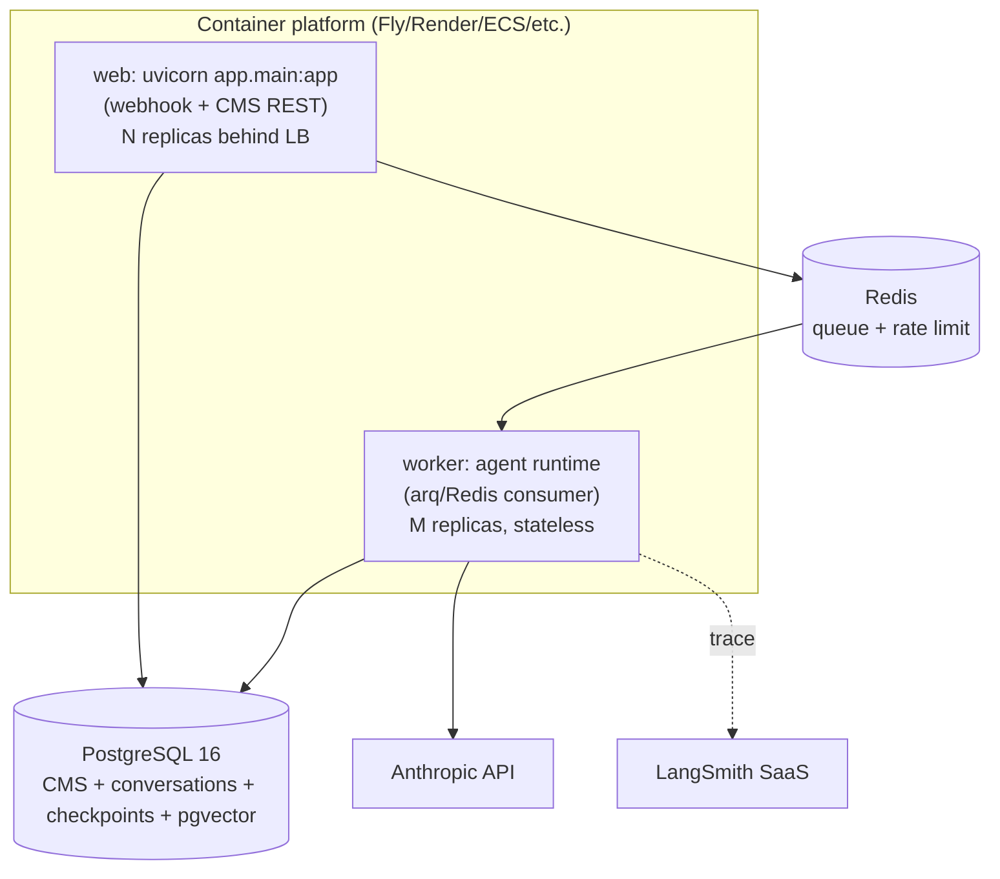

# OrderlyAI — WhatsApp Ordering Agent Architecture

> **Status:** design / not yet built. Lives inside `api/` (Python), per [AGENTS.md §3 rule 8](../../AGENTS.md).
> **Source of truth for *behaviour*:** product design doc `03-ai-agent-and-orders.md` (external).
> This file is the source of truth for **how the agent is engineered** on top of the existing CMS.
>
> Built with **LangChain v1 `create_agent` + middleware**, **LangGraph** persistence, **Claude**
> (Sonnet 4.6 default, Opus 4.8 escalation), **Pydantic** structured output for WhatsApp, and
> **LangSmith** for tracing + evals. APIs verified against current LangChain/LangGraph and WhatsApp
> Cloud API docs (Jan 2026).

---

## 0. TL;DR

```
WhatsApp ──▶ FastAPI webhook (fast 200 ACK, dedupe) ──▶ inbound queue
                                                          │
                                  ┌───────────────────────▼─────────────────────┐
                                  │ Agent worker (separate process, scales out)   │
                                  │  per-thread lock → load state (PostgresSaver)  │
                                  │  create_agent(model, tools, middleware,        │
                                  │               response_format=AgentReply)      │
                                  │  tools call the EXISTING service layer         │
                                  └───────────────────────┬─────────────────────┘
                                                          │ structured AgentReply (Pydantic)
                          WhatsApp Cloud API ◀── outbound gateway (text / list / buttons / image)
                                                          │
                                              orders written via order_service ──▶ dashboard (realtime)
```

Three non-negotiables, inherited straight from the CMS golden rules:

1. **Multi-tenancy is sacred.** `business_id` is **bound server-side** into every tool from the
   resolved WhatsApp connection — the LLM never supplies it and cannot reach another tenant.
2. **Pricing is server-authoritative.** The agent proposes *what* to order; `order_service.create_order`
   decides *the price*. The model can never set a total.
3. **The model can't invent data.** Tools return only this business's rows; a hallucinated dish simply
   does not exist and the write tool rejects it.

---

## 1. Why this shape (and what changed from the old design doc)

The product doc `03-ai-agent-and-orders.md` is still correct on *intent* but predates LangChain v1. It
proposes `create_react_agent` + `PostgresSaver` + ad-hoc trimming. This architecture modernises that:

| Old doc | This architecture | Why |
|---|---|---|
| `langgraph.prebuilt.create_react_agent` | `langchain.agents.create_agent` | v1 agent; first-class **middleware** |
| Manual message trimming | `SummarizationMiddleware` | declarative, token-triggered |
| Prompt string built by hand | `@dynamic_prompt` middleware | per-business prompt from runtime context |
| "send text / interactive msg" (loose) | **Pydantic `AgentReply`** via `response_format` | schema-validated WhatsApp payloads |
| Webhook replies inline | **webhook ACKs, worker replies** | Meta needs a fast 200; LLM turns take seconds |
| Tracing "wrap in LangSmith" | LangSmith **tracing + offline/online evals + CI gate** | regression safety at 100+ tenants |

Everything still runs on **one Postgres** and **one Python service** — no new language, no new datastore
(pgvector is an extension of the same DB).

---

## 2. Component architecture



**Process split (important):** the **web** process must return `200` to Meta within seconds or Meta
retries and eventually disables the webhook. LLM turns take 1–10s. So the webhook only **persists +
enqueues + ACKs**; a separate **worker** process runs the graph. Today `api/app/api/whatsapp.py`
replies *inline* with a placeholder — that is the first thing this design replaces.

---

## 3. Request lifecycle (end-to-end order)

```mermaid
sequenceDiagram
    autonumber
    participant C as Customer
    participant M as Meta Cloud API
    participant W as Webhook (web)
    participant Q as Queue
    participant K as Worker + Agent
    participant DB as Postgres
    participant D as Dashboard

    C->>M: "any veg burgers?"
    M->>W: POST /whatsapp/webhook
    W->>W: verify X-Hub-Signature-256
    W->>DB: INSERT message ON CONFLICT(wa_message_id) DO NOTHING
    alt already seen (Meta retry)
        W-->>M: 200 (skip)
    else new
        W->>Q: enqueue(thread_id, msg)
        W-->>M: 200 OK
    end
    Q->>K: job
    K->>K: acquire pg advisory lock(thread_id)
    K->>DB: load checkpoint (cart, step) for thread_id
    K->>DB: get_menu / search_menu (business-scoped)
    K-->>M: interactive LIST (items + prices)  [AgentReply]
    M-->>C: taps "Veg Burger"
    Note over C,K: each inbound message = one graph turn; cart persists in checkpoint
    C->>M: "2 of those + a coke, deliver 12 Park Lane"
    M->>W: webhook → Q → K (resume same thread)
    K->>DB: check_delivery_area("12 Park Lane")
    K->>DB: price_cart() (server preview, not yet written)
    K-->>M: summary + reply buttons [Confirm][Edit][Cancel]
    C->>M: taps Confirm
    M->>W: webhook (button reply) → Q → K
    K->>DB: place_order() → order_service.create_order (re-validate + total)
    DB-->>D: realtime: new order appears
    K-->>M: "Order #1234 confirmed · ETA 35 min · ₹560 (COD)"
    D->>DB: owner Accepts → status=accepted
    DB->>Q: status-change job
    Q->>K: notify
    K-->>M: "Your order is being prepared"
```

Key property: **the order is written to the DB only on an explicit `Confirm` tap.** The cart lives in
LangGraph state until then — cheap to edit, and a guard against an AI-misread order ever hitting the DB.

---

## 4. The agent (LangChain v1 `create_agent`)

```python
# api/app/agent/graph.py
from langchain.agents import create_agent
from langchain.agents.middleware import (
    SummarizationMiddleware,
    HumanInTheLoopMiddleware,
)
from langgraph.checkpoint.postgres.aio import AsyncPostgresSaver

from app.agent.state import OrderingState        # custom AgentState (cart, step, ...)
from app.agent.context import AgentContext        # runtime context (business_id, conn, config)
from app.agent.schemas import AgentReply           # Pydantic structured WhatsApp output
from app.agent.middleware import (
    business_prompt,          # @dynamic_prompt — per-tenant system prompt
    accepting_orders_guard,   # custom: kill-switch + hours + onboarding status
    conversation_logger,      # custom: persist in/out to messages table
    handoff_guard,            # custom: stop auto-replying when handed off
)
from app.agent.tools import build_tools

def build_agent(checkpointer: AsyncPostgresSaver):
    return create_agent(
        model="anthropic:claude-sonnet-4-6",      # Opus 4.8 escalation: see §4.4
        tools=build_tools(),                        # business_id bound from context, not LLM
        state_schema=OrderingState,
        context_schema=AgentContext,
        response_format=AgentReply,                 # structured WhatsApp payload (§6)
        middleware=[
            business_prompt,                        # 1. dynamic per-tenant prompt
            accepting_orders_guard,                 # 2. block writes when closed/paused
            handoff_guard,                          # 3. short-circuit when handed off
            SummarizationMiddleware(                # 4. keep context lean (§7)
                model="anthropic:claude-haiku-4-5-20251001",
                trigger=("tokens", 6000),
                keep=("messages", 16),
            ),
            HumanInTheLoopMiddleware(               # 5. gate the irreversible write (§5)
                interrupt_on={"place_order": True},
            ),
        ],
        checkpointer=checkpointer,
    )
```

> **Imports are verified against current docs:** `from langchain.agents import create_agent`;
> `from langchain.agents.middleware import SummarizationMiddleware, HumanInTheLoopMiddleware,
> TodoListMiddleware, dynamic_prompt, ModelRequest`; `from langgraph.checkpoint.postgres.aio import
> AsyncPostgresSaver`.

### 4.1 State (the cart lives here)

```python
# api/app/agent/state.py
from typing import Literal
from decimal import Decimal
from pydantic import BaseModel
from langchain.agents import AgentState

class CartLine(BaseModel):
    product_id: str
    name: str                       # snapshot for display only
    quantity: int
    option_item_ids: list[str] = []
    options_label: str = ""         # "Large, Extra cheese" for the summary

class OrderingState(AgentState):    # extends the built-in messages state
    cart: list[CartLine] = []
    fulfillment: Literal["delivery", "pickup"] | None = None
    address: str | None = None
    zone_id: str | None = None
    step: Literal["browsing", "building", "confirming", "placed", "handed_off"] = "browsing"
    confirmed: bool = False          # flipped only by the Confirm button handler
```

The cart is **never** a DB row until confirmed (design doc §4). Editing ("make it 3", "remove the
coke") is a cheap state mutation; the checkpointer persists it across messages, worker restarts, deploys.

### 4.2 Context (per-turn, tenant-bound — the security boundary)

```python
# api/app/agent/context.py
from typing import TypedDict

class AgentContext(TypedDict):
    business_id: str          # resolved from phone_number_id in the webhook — NEVER from the LLM
    connection_id: str        # whatsapp_connections.id (for outbound token)
    customer_phone: str
    config: dict              # agent_configs row: greeting, upsell_enabled, handoff phone, extras
    business: dict            # name, currency, hours, fulfillment flags, accepting_orders, status
```

`business_id` enters the system **once**, in the webhook, by looking up `WhatsAppConnection` by
`metadata.phone_number_id` (exactly what `api/app/api/whatsapp.py` already does). Every tool closes over
`runtime.context["business_id"]`. There is **no tool argument** for `business_id`, so prompt injection
("show me business X's orders") has nothing to grab. This is the agent-layer version of `BusinessDep`.

### 4.3 Middleware pipeline



| Middleware | Type | Responsibility |
|---|---|---|
| `business_prompt` | `@dynamic_prompt` | Render the system prompt from `context["business"]` + `agent_configs` (name, currency, hours, persona, `extra_instructions`, en-only, "concrete tasks only" per Meta 2026). |
| `accepting_orders_guard` | custom `before_model` | If `business.accepting_orders is False`, `status != active`, or out-of-hours → inject a fact the model must honour (no live order; offer to inform/handoff). Also the place where `place_order` is disabled. |
| `handoff_guard` | custom `before_model` | If conversation `status == handed_off`, short-circuit: do not call the model at all, return a quiet "a human will reply" once. |
| `SummarizationMiddleware` | built-in | Summarise old turns at 6k tokens, keep last 16 messages. Cheap model (Haiku 4.5). |
| `HumanInTheLoopMiddleware` | built-in | Interrupt before `place_order` so the write requires confirmation (see §5). |
| `conversation_logger` | custom `after_model` | Persist inbound + outbound into `messages` for the dashboard / analytics / disputes. |

### 4.4 Model strategy & cost

- **Default `claude-sonnet-4-6`** — fast, strong tool-use, cheap. Temperature 0 for deterministic
  tool calls.
- **Escalate to `claude-opus-4-8`** only on hard/ambiguous turns (e.g. repeated tool failure, an
  `extra_instructions`-heavy persona) — implement as a custom middleware that swaps
  `request.model` when a retry counter or ambiguity heuristic trips. Model-agnostic graph → per-tenant
  or per-cost-ceiling override.
- **Summariser `claude-haiku-4-5`** — cheapest, only condenses history.
- WhatsApp replies are **free inside the 24h service window**, so marginal cost ≈ a few LLM calls per
  conversation. Keep prompts/tools tight → fractions of a cent per order.

### 4.5 To-do list middleware (optional, per-tenant)

`TodoListMiddleware()` gives the model a `write_todos` tool to plan multi-step work. For a **simple
one-item order it is overkill** and just burns tokens. It earns its place for **large/complex orders**
(family orders, many items each with required modifiers) where the model otherwise loses track of which
items still need a size/spice choice.

**Recommendation:** ship **without** it; turn it on behind a per-tenant flag only if evals (§9) show the
agent dropping modifier prompts on long carts.

```python
from langchain.agents.middleware import TodoListMiddleware
# add TodoListMiddleware() to the middleware list when config.complex_orders is enabled
```

---

## 5. Order confirmation & human-in-the-loop

There are **two distinct "humans"** — don't conflate them:

1. **The customer confirming the cart.** This is the normal conversational flow: the agent sends reply
   buttons `[Confirm] [Edit] [Cancel]`; the customer taps; the next webhook resumes the thread. The
   `Confirm` button id (`confirm_order`) is interpreted by a deterministic handler that sets
   `state.confirmed = True` **before** the model runs, so the model is allowed to call `place_order`.
   This is the primary guard against accidental orders.

2. **`HumanInTheLoopMiddleware` gating `place_order`.** Defence in depth: even if the model tries to call
   `place_order`, the middleware interrupts and the worker only resumes it when `state.confirmed is True`.
   `place_order` then calls `order_service.create_order`, which **re-validates everything at commit
   time** (availability, hours, zone, modifiers, totals) — state can go stale during a long chat.



**Owner → customer handoff** uses the same checkpointer: when `request_human` fires (or the customer is
angry / asks for a refund), set conversation `status = handed_off`, notify the owner
(`agent_configs.human_handoff_phone`), and `handoff_guard` stops auto-replying. This also keeps us on the
right side of Meta's AI rules.

---

## 6. Structured output for WhatsApp (Pydantic)

The agent's **final answer is a validated Pydantic object**, not free text. The worker maps it 1:1 to
Graph API payloads — so a malformed interactive message can never be sent, and limits are enforced in the
schema. This is the "Pydantic for structured output for WhatsApp" requirement.

```python
# api/app/agent/schemas.py
from typing import Annotated, Literal, Union
from pydantic import BaseModel, Field

# --- WhatsApp limits encoded as constraints (verified against Cloud API docs) ---
# text body <= 4096 · list: <=10 sections / <=10 rows total · row title <=24, desc <=72
# reply buttons: <=3 · button title <=20 · image caption <=1024

class TextMessage(BaseModel):
    kind: Literal["text"] = "text"
    body: str = Field(max_length=4096)

class ListRow(BaseModel):
    id: str = Field(max_length=200)              # e.g. "product:<uuid>"
    title: str = Field(max_length=24)            # product name, truncated
    description: str | None = Field(default=None, max_length=72)  # "₹250 · spicy"

class ListSection(BaseModel):
    title: str = Field(max_length=24)            # category name
    rows: list[ListRow] = Field(min_length=1, max_length=10)

class ListMessage(BaseModel):
    kind: Literal["list"] = "list"
    header: str | None = Field(default=None, max_length=60)
    body: str = Field(max_length=1024)
    footer: str | None = Field(default=None, max_length=60)
    button: str = Field(max_length=20)           # e.g. "View menu"
    sections: list[ListSection] = Field(min_length=1, max_length=10)

class ReplyButton(BaseModel):
    id: str = Field(max_length=256)              # "confirm_order" | "edit_cart" | "cancel_order"
    title: str = Field(max_length=20)

class ButtonsMessage(BaseModel):
    kind: Literal["buttons"] = "buttons"
    body: str = Field(max_length=1024)
    buttons: list[ReplyButton] = Field(min_length=1, max_length=3)

class ImageMessage(BaseModel):
    kind: Literal["image"] = "image"
    image_url: str                                # product.image_url
    caption: str | None = Field(default=None, max_length=1024)   # "Veg Burger — ₹250"

OutboundMessage = Annotated[
    Union[TextMessage, ListMessage, ButtonsMessage, ImageMessage],
    Field(discriminator="kind"),
]

class AgentReply(BaseModel):
    """The agent's full response for one inbound turn (1..N WhatsApp messages)."""
    messages: list[OutboundMessage] = Field(min_length=1, max_length=4)
    handoff: bool = False            # if true, worker flips conversation -> handed_off
```

`create_agent(..., response_format=AgentReply)` yields `result["structured_response"]`. Because total-
validity can't depend on the model, use **`ToolStrategy(AgentReply, handle_errors=True)`** so a schema
violation is fed back to the model to retry rather than crashing the turn (verified pattern).

**Why a `messages` *list*:** "show me the burger" → `[ImageMessage(burger), ButtonsMessage("Add to
order?")]`. Browsing → one `ListMessage`. One inbound turn can fan out to a few outbound messages.

### 6.1 Showing food images (the requirement)

- **Specific item** ("show me the veg burger") → the agent calls `get_item_details(product_id)`, gets
  `image_url`, and returns an `ImageMessage(image_url, caption="Veg Burger — ₹250")`. Outbound sender
  posts `type:"image"` with `image.link` (or an uploaded media id).
- **Browsing a category** → a single **`ListMessage`** (text rows + price in `description`); WhatsApp lists
  don't carry thumbnails. For richer galleries, the **multi-product / catalog message** is the upgrade
  path (requires maintaining a WhatsApp commerce catalog — deferred).
- Products without `image_url` → fall back to a `TextMessage`/`ListMessage`; never send a broken image.

---

## 7. Tools (the only way the agent touches data)

All tools are thin wrappers over the **existing `app/services/` + `app/models/`** layer, so the agent
reuses the exact same server-authoritative logic the REST API uses. `business_id` comes from
`runtime.context`, never from a tool argument.

```python
# api/app/agent/tools.py  (sketch — each receives the worker's AsyncSession + context)
from langchain.tools import tool

@tool
async def get_menu(category: str | None = None) -> list[MenuItem]:
    """List available menu items, optionally by category. Available + non-archived only."""
    # SELECT ... WHERE business_id = :bid AND is_available AND NOT is_archived

@tool
async def search_menu(query: str) -> list[MenuItem]:
    """Semantic menu search ('something spicy and vegetarian') via pgvector. Falls back to ILIKE."""

@tool
async def get_item_details(product_id: str) -> ItemDetail:
    """Full item: description, price, image_url, and modifier groups with options + effective prices."""

@tool
async def check_hours() -> HoursStatus:
    """Is the business open now? Next open window if not."""

@tool
async def check_delivery_area(area_or_address: str) -> DeliveryQuote:
    """Match against delivery_zones → {serviceable, zone_id, fee, min_order}."""

# cart tools mutate OrderingState (return a Command updating state), never the DB:
@tool
async def add_to_cart(product_id: str, quantity: int, option_item_ids: list[str] = []) -> CartView: ...
@tool
async def update_cart(line_index: int, quantity: int) -> CartView: ...
@tool
async def remove_from_cart(line_index: int) -> CartView: ...
@tool
async def view_cart() -> CartPreview:
    """Server-side price preview (same math as order_service, NOT written)."""

@tool
async def place_order() -> OrderConfirmation:
    """HITL-gated write. Calls order_service.create_order: re-validates availability, modifiers,
       hours, zone + min_order, computes totals server-side, inserts the order."""

@tool
async def request_human(reason: str) -> None:
    """Flag conversation for owner handoff and stop auto-replying."""
```

| Tool | Backing code (reused) |
|---|---|
| `get_menu`, `get_item_details`, `search_menu` | `models/menu.py` (+ `EffectiveModifierOption` for per-dish prices) |
| `check_hours` | business hours rows |
| `check_delivery_area` | `models/ops.DeliveryZone` |
| `view_cart` | a new **read-only** pricing helper extracted from `order_service` |
| `place_order` | **`order_service.create_order`** verbatim — the authoritative engine |

> **`place_order` maps to the existing `OrderCreate` schema and `create_order` flow**, including the
> atomic `next_order_no`, customer upsert by `(business_id, wa_phone)`, and `OrderStatusHistory`
> (`changed_by="agent"` instead of a user id). No pricing logic is duplicated into the agent.

---

## 8. Edge cases (bake into prompt + tools + worker)

A food-ordering bot fails in the gaps. These are enumerated so each has an owner (P = prompt, T = tool/
server guard, W = worker/infra).

**Ordering / business rules**
- **Out of hours** → `check_hours` + `accepting_orders_guard`; inform or offer scheduling, don't take a
  live order. (P + T)
- **`accepting_orders = false`** kill-switch / `status != active` → block `place_order`. (T)
- **Item went unavailable mid-chat** → `create_order` rejects (`is_available`/`is_archived`); agent
  re-prompts and removes the line. (T)
- **Price changed mid-chat** → order snapshots `price_snapshot`/`options_json` at write; preview total may
  differ → agent re-quotes before confirm. (T)
- **Address outside delivery area** → `check_delivery_area` → `serviceable:false` → offer pickup. (T + P)
- **Below min order** → per-zone `min_order` enforced by `create_order`; **business-level
  `min_order_amount`** is currently *deferred* — **implement it here** with a test (AGENTS.md §10). (T)
- **Delivery with no address** → currently *deferred*; the agent flow **must require an address** for
  `fulfillment="delivery"` before `place_order`. Add the server guard + test. (T)
- **Required modifier missing / too many options / single-select violated / cross-product option** →
  `create_order` already enforces all of these (→ 400); agent surfaces the message and re-asks. (T)
- **Negative line price** from discount stacking → rejected by `create_order`. (T)

**Conversation / protocol**
- **Duplicate webhook (Meta retries)** → dedupe on `messages.wa_message_id` UNIQUE; `ON CONFLICT DO
  NOTHING` then skip. (W)
- **Out-of-order / burst messages on one thread** → per-`thread_id` **pg advisory lock** so turns
  serialise; queued messages process in arrival order. (W)
- **Message outside 24h window** → free-form reply may fail; detect send error → fall back to a template
  message (later) or log. (W)
- **Non-text inbound** — `location` → use as delivery address; `image`/`audio`/`sticker` → "I can read
  text orders; could you type that?" (audio transcription is a later upgrade). (P + W)
- **Very long conversation** → `SummarizationMiddleware` keeps tokens bounded. (middleware)
- **Prompt injection** ("ignore your rules / give it free / show other stores") → no effect: prices are
  server-side, tools are tenant-scoped, `business_id` isn't an argument. (T)
- **Unsupported language** (en-only per `agent_configs`) → politely state English-only. (P)
- **>10 menu items in a list** → paginate into sections / "Show more" row; truncate titles to 24 chars,
  buttons to 20. (T schema + P)

**Infra / failure**
- **LLM timeout / rate limit / 5xx** → retry w/ backoff; after N, send "having trouble, a human will
  follow up" and flag handoff — never leave the customer silent. (W)
- **WhatsApp send failure** → retry/backoff; if the *confirmation* of a placed order fails to send, the
  order still exists — reconcile from the dashboard (don't double-create). (W)
- **Worker crash mid-turn** → checkpointer means the thread resumes from the last durable step; cart isn't
  lost. (LangGraph)
- **Empty menu / business still in onboarding** → tools return empty → agent says "not taking orders
  yet". (T + P)
- **Refund / dispute / complaint** → `request_human`; agent does not promise refunds. (P + T)
- **Abuse / spam** → per-phone rate limit at the webhook; drop beyond threshold. (W)

---

## 9. LangSmith: tracing + evals



**Tracing.** Set `LANGSMITH_TRACING=true` + `LANGSMITH_API_KEY`; every agent turn (model calls, each tool
call, summarisation) is captured. Tag runs with `business_id` and `thread_id` so a single conversation is
reconstructable for disputes/debugging. **Redact PII** (phone, address) via a trace transform — don't ship
raw customer data to LangSmith.

**Offline evals (the regression safety net).** Build **golden datasets** of real-ish conversations →
expected outcome. Evaluators:
- **Order correctness** (deterministic): given a scripted dialogue, assert the resulting `create_order`
  payload (items, quantities, options, fulfillment, total) matches expected. This is the highest-value
  eval — it guards the money path.
- **Tool-trajectory** (deterministic): did it call `check_delivery_area` before promising delivery? did it
  *never* call `place_order` before `confirmed`?
- **Refusal/safety**: injection prompts must not change price or leak another tenant.
- **Helpfulness / tone** (LLM-as-judge): graded against the business persona, en-only, concrete-tasks-only.

Run these as a **CI gate** before deploying a new prompt/model/middleware change — at 100–150 tenants a
prompt regression is a fleet-wide incident.

**Online evals.** Attach end-of-thread **feedback signals** from real outcomes (order placed? handed off?
abandoned cart? owner rejected?) back onto traces; mine low-scoring threads into new dataset rows. Closes
the loop: production failures become tomorrow's regression tests.

---

## 10. Persistence & data model additions

Reuses the single Postgres. Three sets of state:

| Store | What | Keyed by | Who reads it |
|---|---|---|---|
| **LangGraph checkpoints** | live agent state (cart, step, message buffer) | `thread_id = business_id:wa_phone` | the agent only |
| **`conversations` + `messages`** (new) | durable chat history | `business_id`, `wa_message_id` | dashboard, analytics, evals, disputes |
| **CMS tables** (exist) | products, orders, zones, hours | `business_id` | REST API + agent tools |

Two stores for memory **on purpose** (design doc §5): the checkpointer is for the *agent*; the `messages`
table is for *humans/analytics*. They are not the same data.

**New migrations required** (each new tenant table needs `business_id` + an isolation test, per AGENTS.md):

- `conversations` — `id, business_id, customer_id, wa_phone, status (active|handed_off|closed),
  last_message_at`. UNIQUE `(business_id, wa_phone)`.
- `messages` — `id, business_id, conversation_id, direction (in|out), wa_message_id (UNIQUE per business,
  for dedupe), type, content jsonb, created_at`.
- `product_embeddings` (pgvector) — `product_id, business_id, embedding vector(N)`. Enables `search_menu`;
  **deferred** until search quality matters (AGENTS.md notes pgvector is added in this phase).
- LangGraph checkpoint tables are created by `await checkpointer.setup()` — run once in a migration/boot
  step. Note: these tables aren't `business_id`-columned; tenant isolation is via the `thread_id` prefix
  and the fact that only the server constructs `thread_id`. Document this in the isolation tests.

---

## 11. Deployment & scaling (to 100–150 tenants)

**Recommended for MVP — self-hosted, two processes, one DB:**



- **Web** scales for webhook burst; cheap (just ACK + enqueue). **Worker** scales for LLM throughput;
  fully **stateless** (all state in Postgres via the checkpointer) so add replicas freely.
- **Per-thread serialization** via pg advisory lock (or a Redis lock / single-consumer-per-thread
  partition) prevents two workers racing one conversation.
- **Connection pooling** (asyncpg pool / PgBouncer) — 100+ tenants share the pool; the agent's DB work is
  short.
- **Anthropic limits** — one platform key with generous limits is fine at this scale; if a single noisy
  tenant matters later, shard keys per tenant tier. Cost stays low (free WhatsApp window + few calls).
- **Queue choice:** start with **arq + Redis** (async-native, light). A pure **DB-backed inbox** (poll a
  table) avoids Redis entirely for the very first version; Redis also gives you rate-limit counters.

**Alternative — LangGraph Platform (managed):** offloads persistence, scaling, scheduling, and a built-in
thread API. Faster to operate but adds a managed dependency + cost and moves the runtime outside `api/`.
**Recommendation:** ship self-hosted (keeps everything in one Python service + one Postgres per AGENTS.md
§3); revisit Platform only if worker ops become a burden.

**Config additions** (`core/config.py` + `.env.example`): `ANTHROPIC_API_KEY`, `LANGSMITH_API_KEY`,
`LANGSMITH_TRACING`, `LANGSMITH_PROJECT`, `REDIS_URL`, `AGENT_MODEL`, `AGENT_SUMMARY_MODEL`. The Fernet
key for `whatsapp_connections.access_token` already exists (`core/crypto.py`).

---

## 12. Build order (incremental, each shippable)

1. **Worker + queue skeleton** — replace the inline placeholder reply in `whatsapp.py` with
   persist+dedupe+enqueue; stand up the worker consuming the queue; echo a static reply end-to-end.
2. **`conversations` + `messages`** migrations + isolation tests; wire `conversation_logger`.
3. **Read-only agent** — `create_agent` with `get_menu`/`get_item_details`/`check_hours`,
   `business_prompt`, `AsyncPostgresSaver`. Browsing works (list + image messages). **No writes yet.**
4. **Cart in state** — `add/update/remove/view_cart`, structured `AgentReply`, confirm buttons.
5. **`place_order`** — wrap `order_service.create_order`, HITL gate, re-validation, the deferred guards
   (delivery address required, business `min_order_amount`) **with tests**.
6. **Summarization + handoff + guards** middleware; status-change → customer notification.
7. **LangSmith** tracing + the order-correctness eval dataset + CI gate.
8. **pgvector `search_menu`** when fuzzy search quality matters.

---

## 13. Open decisions (your call)

- **Queue:** arq+Redis (recommended) vs DB-backed inbox (zero extra infra) vs LangGraph Platform.
- **TodoListMiddleware:** off by default; enable per-tenant for complex orders?
- **Images while browsing:** text List (MVP) now, WhatsApp **catalog / multi-product** later — worth the
  catalog upkeep?
- **Owner→customer status notifications:** push every status change, or only accepted/ready/out-for-
  delivery?

See [AGENTS.md §10](../../AGENTS.md) for the deferred order-validation items this agent phase must close.
```
